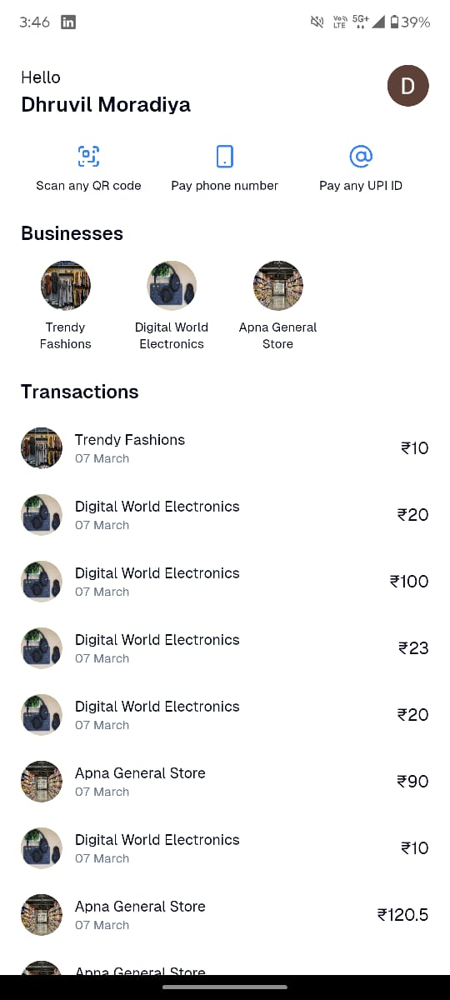
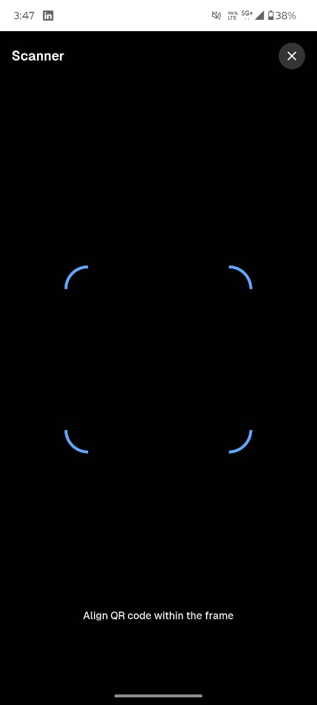
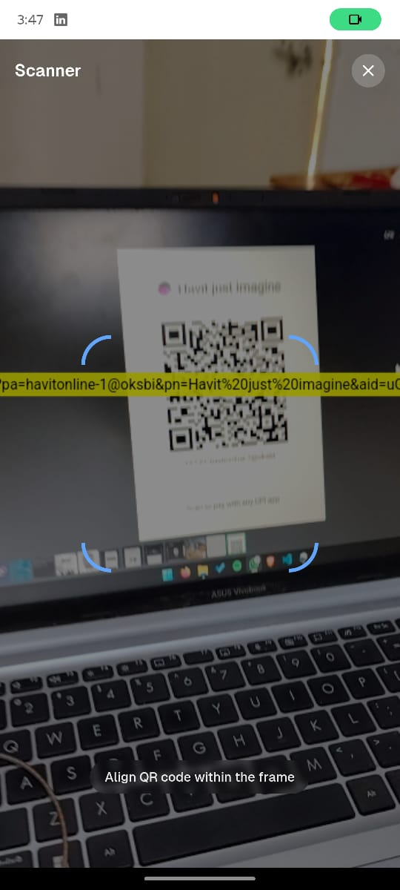
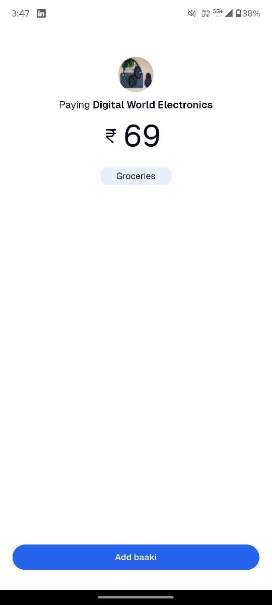
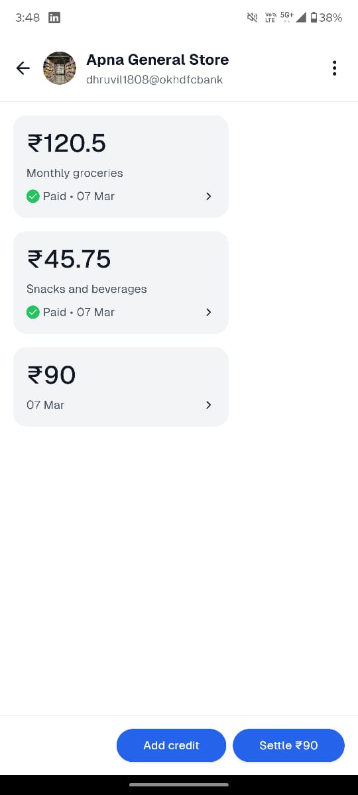
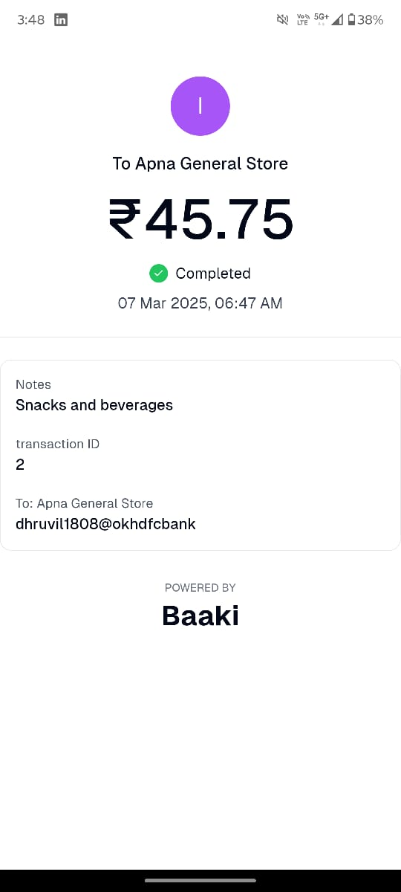
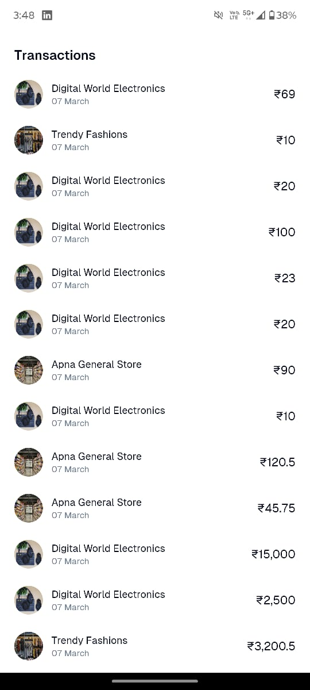
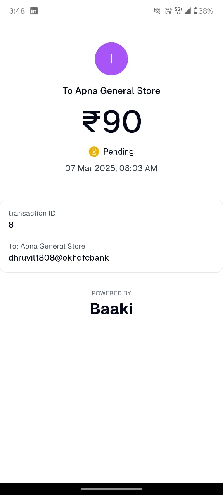

# Baaki - Digital Credit Management System

## 📌 Overview

Baaki is an innovative digital credit management solution designed to seamlessly integrate with UPI QR codes. It empowers small and medium-sized shopkeepers by simplifying credit transactions, reducing errors, and improving financial tracking.

## 🤔 Why Baaki?

In India, small businesses rely heavily on credit-based transactions, often recorded manually in notebooks. This method is prone to errors, missed payments, and financial mismanagement. **Baaki** aims to solve this by digitizing credit transactions, ensuring accuracy, and reducing the operational burden on shopkeepers. The incentive is to create a reliable, scalable, and user-friendly system that enhances financial transparency and trust between shopkeepers and customers.

## 🚀 Features

- **Seamless UPI Integration**: Works with existing UPI QR codes for effortless credit logging.
- **Automatic Record Updates**: Real-time credit tracking for both shopkeepers and customers.
- **Error Reduction**: Eliminates manual entries, minimizing financial discrepancies.
- **User-Friendly Interface**: Designed for ease of use, requiring no additional training or hardware.
- **Scalability & Security**: Built with modern technologies for optimal performance.

## 📸 Screenshots

  <!-- Row 1 -->
  
  
  
  
  <!-- Row 2 -->
  
  
  
  
  <!-- Row 3 -->
  
  
  
  
  <!-- Row 4 -->
  
  

## 🛠️ Technologies Used

- **Frontend & Backend**: NextJS (Full Stack JS Framework),PWA(Progressive Web App)
- **Database**: Turso (Distributed edge-optimized sqlite database)
- **Messaging & Notifications**: Firebase Cloud Messaging (FCM)
- **Deployment & CI/CD**: GitHub Actions, DevOps automation

## 🎯 Problem Statement

Traditional credit transactions involve manual entries, leading to:

- High risk of errors and financial mismanagement.
- Time-consuming record consolidation.
- Difficulties in managing credit during peak hours.

## ✅ Solution

Baaki replaces outdated manual processes with a **digital-first approach**, ensuring:

- Instant logging of credit transactions by scanning UPI QR codes.
- Secure and automated record-keeping.
- Increased efficiency for shopkeepers, reducing losses due to forgotten payments.

## 📈 Market Potential

Baaki is targeting India's vast unorganized retail sector:

- **13M+** Kirana stores and small businesses.
- **$3.04B** furniture hardware market (2024).
- **$2.37B** school stationery market (2023), projected to grow at 5.3% CAGR.
- **$165B** textile and apparel market, estimated to reach $350B by 2030.

## 🎯 Target Customers

- Small & medium-sized shopkeepers and wholesalers.
- Businesses in urban and semi-urban areas with growing digital payment adoption.

## 💰 Business Model

Baaki follows a **freemium model**:

- **Basic Plan**: Free access to essential features.
- **Advanced Plan**: Subscription-based model with premium features such as WhatsApp/SMS notifications and enhanced analytics.

## 👥 Team

- **Ansh U. Chamriya** (Leader & Developer)
- **Dhruvil A. Moradiya** (Fullstack Developer)
- **Harsh R. Gavit** (Fullstack Developer)
- **Kaushal L. Radadiya** (Frontend Developer)

---

🌟 **Empowering Small Businesses with Seamless Digital Credit Management!** 🌟
